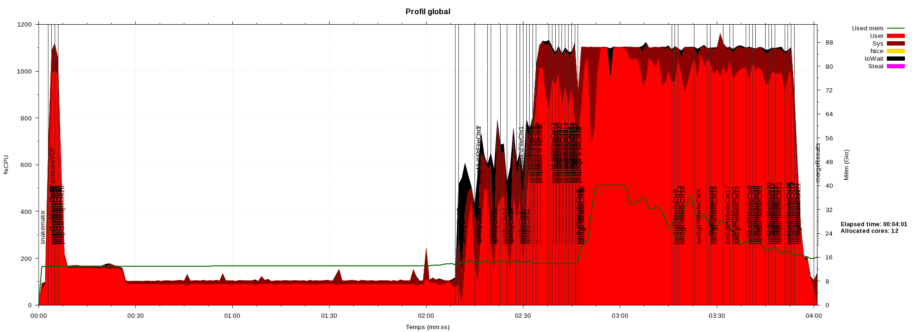
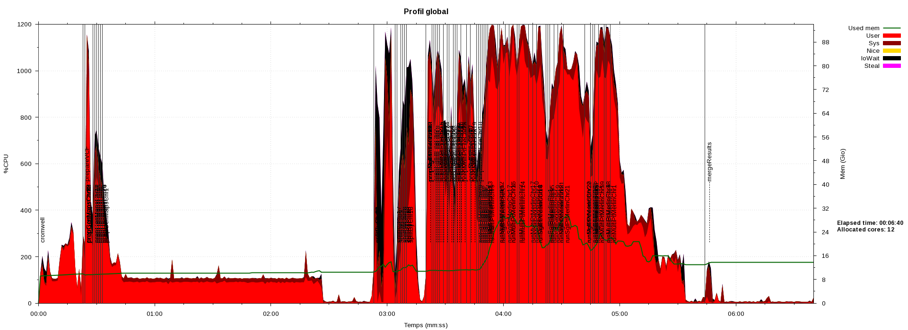
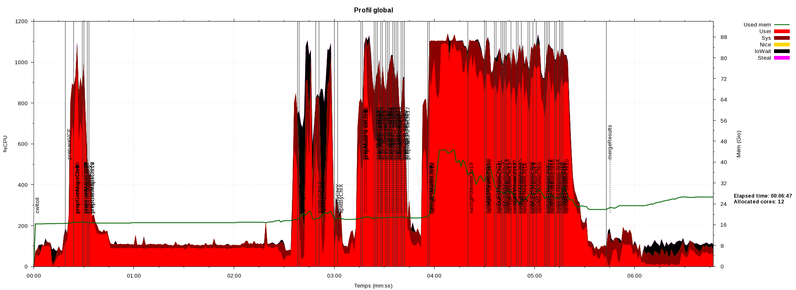

Examples of sar CPU/memory profiles for each implementation of 
the LodSeq workflow executed on a 12-core node, with the full dataset as inputs:

- pegasus-mpi-cluster

- snakemake

- nextflow

- cromwell

- cwltoil

